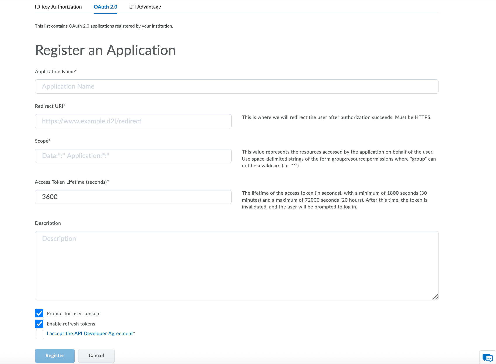
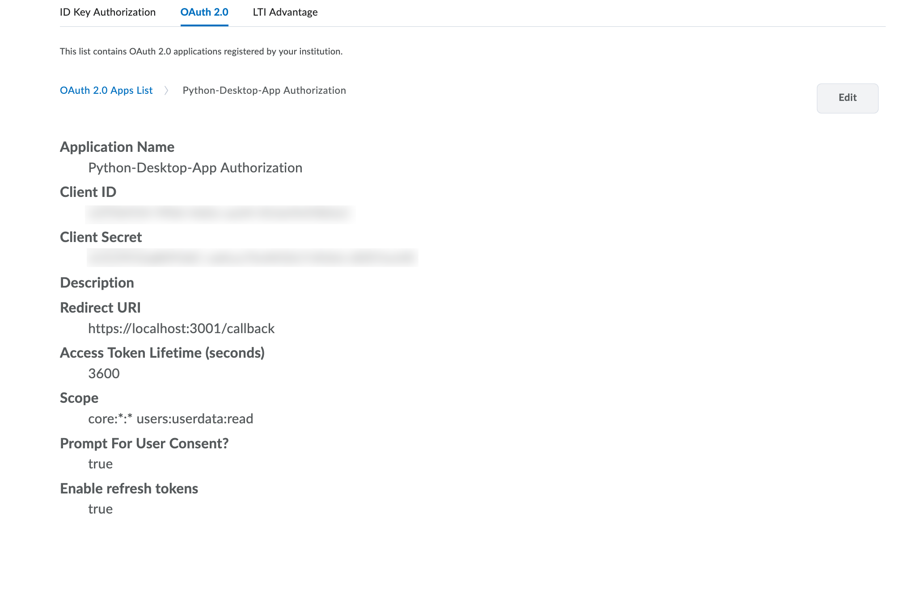

## Create a D2L OAuth 2.0 App (Manage Extensibility)

This guide walks you through creating an OAuth 2.0 application in Brightspace and wiring it to this repo so you can run the WhoAmI example locally.

### Prerequisites
- Admin access to Brightspace Manage Extensibility
- The local app from this repo set up on your machine

### 1) Open Manage Extensibility → OAuth 2.0
In Brightspace (D2L):
- Go to Admin Tools → Manage Extensibility
- Select the "OAuth 2.0" tab
- Click "Register an Application"



### 2) Fill out the registration form
- Application Name: something like "Python-Desktop-App Authorization"
- Redirect URI: `https://localhost:3001/callback`
- Scope: `core:*:* users:userdata:read`
- Access Token Lifetime (seconds): `3600` is fine for development
- Check "Prompt for user consent"
- Check "Enable refresh tokens"
- Accept the API Developer Agreement
- Click Register

Notes
- The Redirect URI must exactly match what the app uses. If you change ports or paths, update both the OAuth app and your environment variable `D2L_REDIRECT_URI`.
- Scopes used here allow calling the WhoAmI endpoint.

### 3) Copy Client ID (and Client Secret, if confidential)
After registering, you’ll see your app details.



Copy:
- Client ID → set `D2L_CLIENT_ID`
- If the app is configured as a confidential client, also copy Client Secret → set `D2L_CLIENT_SECRET`

### 4) Configure environment variables locally
Set these before running `python app.py`.

macOS (zsh/bash):
```bash
export D2L_ROOT="https://elearning.delta.edu"   # your Brightspace URL
export D2L_CLIENT_ID="<your-client-id>"
# export D2L_CLIENT_SECRET="<your-client-secret>"  # only if confidential
export D2L_REDIRECT_URI="https://localhost:3001/callback"
```

Windows (PowerShell):
```powershell
$env:D2L_ROOT = "https://elearning.delta.edu"
$env:D2L_CLIENT_ID = "<your-client-id>"
# $env:D2L_CLIENT_SECRET = "<your-client-secret>"   # only if confidential
$env:D2L_REDIRECT_URI = "https://localhost:3001/callback"
```

### 5) Run the local app
```bash
python -m venv .venv
source .venv/bin/activate   # Windows: .venv\Scripts\Activate.ps1
pip install -r requirements.txt
python app.py
```

You’ll be prompted in a browser to sign in and consent. On success, the app prints your WhoAmI info.

### 6) Troubleshooting
- 400 unauthorized_client: Ensure you’re not sending a client secret in both the Authorization header and POST body. This project uses HTTP Basic automatically when `D2L_CLIENT_SECRET` is set.
- invalid_grant: Redirect URI mismatch or PKCE verifier mismatch. Ensure the OAuth app Redirect URI matches `D2L_REDIRECT_URI` exactly.
- 401 on API: Ensure `users:userdata:read` is in your scopes.

---

## Add these screenshots to the repo
Save your screenshots locally in the following paths so the images render in this doc:
- `docs/img/register-application.png`
- `docs/img/application-details.png`

Then commit and push:
```bash
git add docs/img/*.png docs/D2L-OAuth-Setup.md README.md
git commit -m "Docs: add D2L OAuth 2.0 setup guide with screenshots"
git push
```

